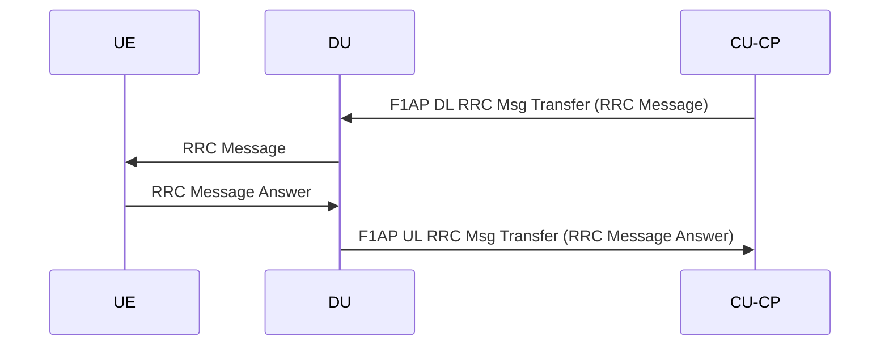
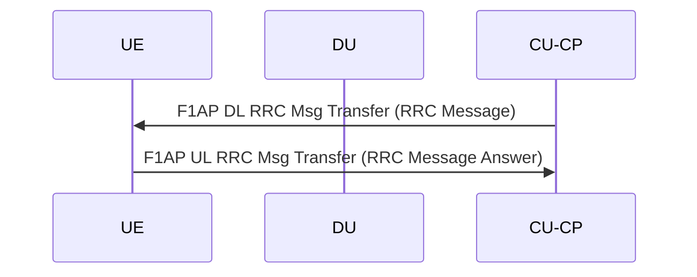
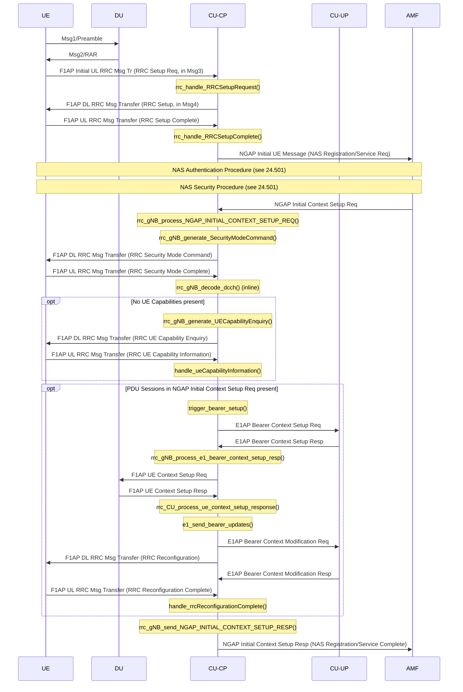
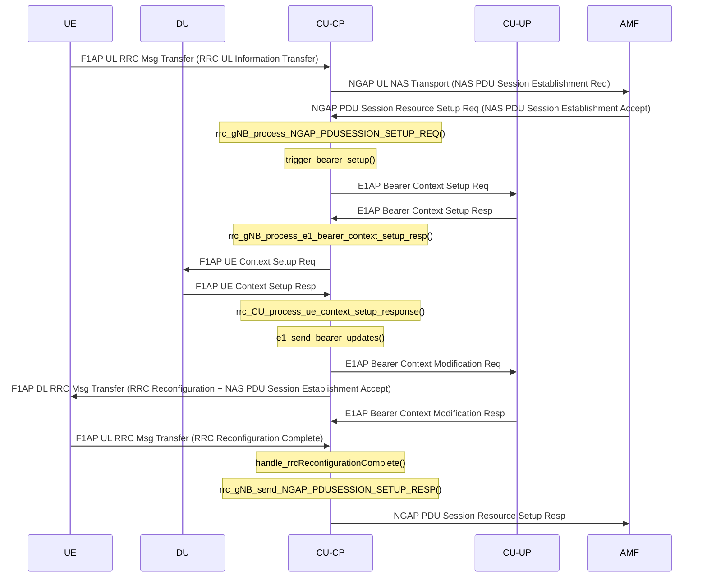
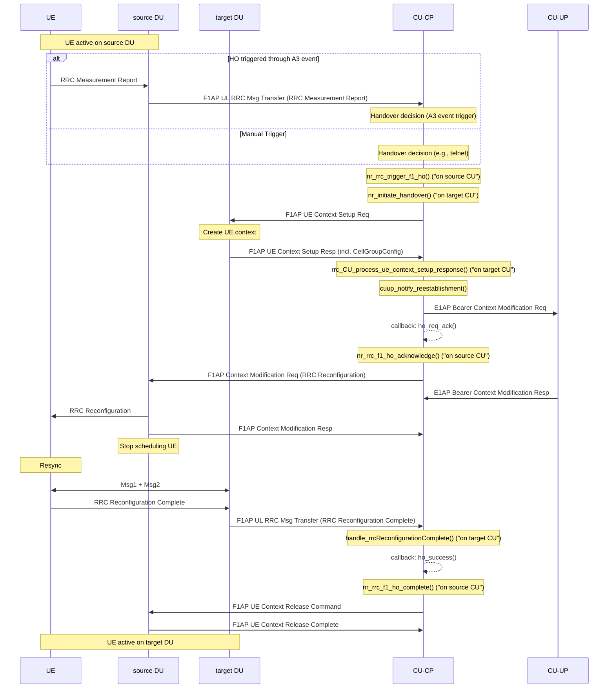

This document contains documentation for the 5G RRC layer, destined towards
developers. It explains the basic working of the RRC, and various UE procedure
schemes (connection, reestablishment, handover) including their interworking
with other layers.

User documentanio, such as general configuration options, are described in [a
separate page](./rrc-usagetmd).

[[_TOC_]]

# General

5G RRC is basically an ITTI message queue with associated handlers. It
sequentially reads received ITTI messages and handles them through the function
`rrc_gnb_task()` (constituing the thread entry point function). In this
function, one can see three main groups of messages in a big switch statement:

- NGAP (messages starting with `NGAP_*`)
- F1AP (messages starting with `F1AP_*`)
- E1AP (messages starting with `E1AP_*`)

For each message, a corresponding handler is called. The messages are roughly
named according to the 3GPP specification messages, so it should already be
possible to find the message in the switch based on a message name in the spec.

Note that RRC is inherently single-threaded, and processes messages in a FIFO
order.

# Sequence Diagrams of UE procedures

The following section presents a number of common UE procedures for connection
establishment&control, bearer establishment, etc. The intention is to help
developers find specific functions within RRC in the context of these
procedures. For more information on message handlers at F1 and E1 layers,
please refer to the respective [F1 documentation](../F1AP/F1-design.md) and [E1
documentation](../E1AP/E1-design.md).

For more information on these procedures, please also refer to 3GPP TS 38.401
(NG-RAN Architecture Description) and O-RAN.WG5.C.1-v11 (NR C-plane profile).

A lot of the following diagrams would show an exchange between CU-CP, DU, and
UE, in which the CU-CP forwards an "RRC Message" to the UE via an F1AP DL RRC
Message Transfer through the DU, and correspondingly receives the "RRC Message
Answer", as follows:

To better utilize horizontal space, these exchanges have been collapsed as
follows, but should be read as the above exchange:

## Initial connection setup/Registration

This sequence diagram shows the principal steps for an initial UE connection.
This can either happen through a _Registration Request_ (e.g., UE connects
"from flight mode"), or a _Service Request_ (i.e., UE connects after leaving
coverage). Both requests are handled similar by the gNB, and basically
distinguish themselves, from the point-of-view of the gNB, by having PDU
sessions in the NGAP Initial Context Setup Request present (Service Request) or
not (Registration Request, with following PDU Session Resource Setup Request
procedure).

Note that if no PDU session is present in the NGAP Initial UE Context Setup
Req, no F1AP UE Context Setup will be observed during this initial phase.

If there is no PDU session set up during NGAP Initial Context Setup Req, the UE
typically requests a PDU session(s) through a NAS procedure, which is basically
the same code paths as the above optional PDU Session setup during an NGAP
Initial Context Setup procedure:

## Reestablishment

    TBD

## Handover

The basic handover (HO) structure is as follows. In order to support various
handover "message passing implementation" (F1AP, NGAP, XnAP), RRC employs
callbacks to signal HO Accept (`ho_req_ack()`), HO Success (`ho_success()`),
and HO Cancel (`ho_cancel()`). These can be used to trigger the corresponding
functionality based on mentioned "message passing implementation".

The following sequence diagram shows the basic functional execution of a
successful handover in the case of an F1 handover. Note the callbacks as
mentioned above:

# Structures

TODO:

- explain xid and transactions
- explain `ho_context`
